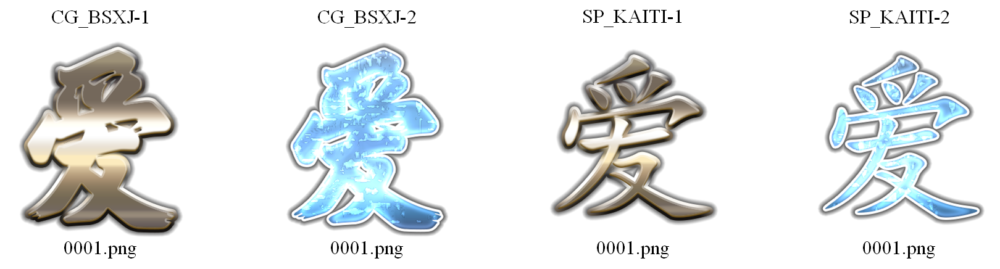

## SSAF Dataset
  
* **Description:** This is a high-quality and multi-style artistic font dataset. It contains 900 categories, each of which contains 1,024 characters, 972 Chinese characters and 52 English characters. The 900 categories of artistic fonts are composed of 30 glyphs and text effects. This dataset also contains the basic glyph data and the corresponding artistic font data. This dataset provides the first systematic division of glyphs:  standard print (SP), creative print (CP), brush calligraphy (CG), and handwriting (HW). This dataset also provides Unicode encoding for characters as a unique annotation for each character.

* **Size:**  50.8GB.

* **Major component description:**  The artistic font images and the basic font images. 

* **Detailed setup instructions:** 

  * For the glyph, we use "CG", "CP", "HW", "SP" to indicate the first level of classification of glyphs, the initials of glyph name to uniquely identify a glyphs, such as "BSXJ".  
  * For the text effect,  we use the Arabic numerals to mark their types, such as "1", "2",...,"30".

  ```
  SSAF
  |--- artistic
  |	  |--- CG_BSXJ-1
  |	 	    |--- 0001.png
  |	 	    |--- ...
  |	  |--- CG_BSXJ-2
  |	 	    |--- 0001.png
  |	 	    |--- ...
  |	  |--- ...
  |	  |--- SP_KAITI-1
  |	 	    |--- 0001.png
  |	 	    |--- ...
  |	  |--- SP_KAITI-2
  |	 	    |--- 0001.png
  |	 	    |--- ...
  |	  |--- ...
  |--- glyph
  |	  |--- CG_BSXJ
  |	 	    |--- 0001.png
  |	 	    |--- ...
  |	  |--- CP_XS24
  |	 	    |--- 0001.png
  |	 	    |--- ...
  |	  |--- HW_ZMJXL
  |	 	    |--- 0001.png
  |	 	    |--- ...
  |	  |--- ...
  |--- unicode
  |	  |--- char.txt
  ```

  

* **Downolad**  (SSAF examples): 

  * [Baidu Drive](https://pan.baidu.com/s/1EFLGSkQ24WcYnZefWRIDyQ?pwd=4jom)
  * [Google Drive](https://drive.google.com/file/d/1KsCmwg3yX0uAgjUe7rKJ8oYctIUO4LIz/view?usp=sharing) 


* **Contact information:**  17561841398@163.com
